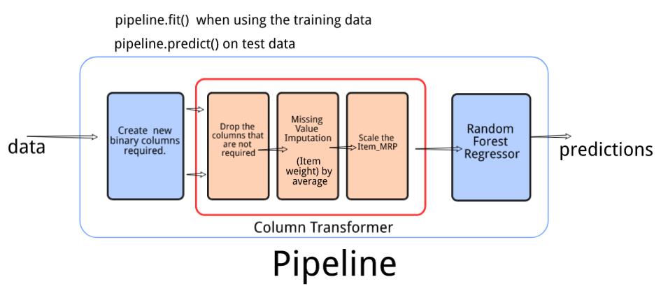
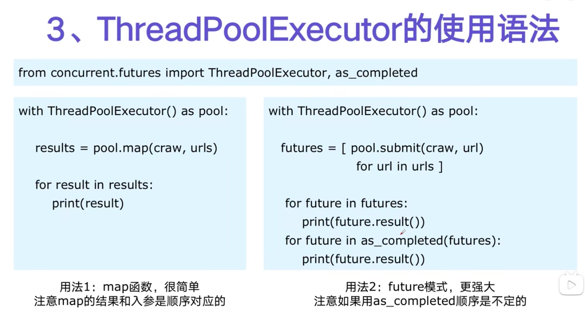

# 多线程编程

## 线程生命周期


## 示例

- 线程处理函数

```python
def my_fn(a, b):
    return a + b
```

- 多线程

```python
import threading

# 创建线程
t = threading.Thread(traget = my_fn, args = (10, 20, n), name = 'threading name')

# 开启线程
t.satrt()

# 等待线程结束
t.join()
```

## pipeline架构



## 线程数据通信 queue.Queue

```python
import queue

# 创建队列
q = queue.Queue()

# 添加元素
q.put(item)

# 获取元素
item = q.get()
```

查询队列

```python
# 查看元素多少
q.qsiez()

# 判断是否为空
q.empty()

# 判断队列是否满了
q.full()
```

## 线程安全

线程安全是指某个函数 函数库在多线程环境中被调用时，能正确处理多个线程之间的共享变量，使得程序能正确执行，由于线程的执行随时会发生线程切换，造成的线程不可预期的错误就是线程不安全。
 
- try  finally

```python
import threading

lock = threading.Lock()
lock.acquire()

try:
  # do something
finally:
  lock.release()
```

- with模式

```python
import threading

lock = threading.Lock()

with lock:
    # do something
```

## 线程池

新建线程系统需要分配资源，终止线程系统需要回收资源。如果可以重用线程可以减少新建与终止开销。

### 使用方法




## 参考

- [intro-to-python-threading](https://realpython.com/intro-to-python-threading/)